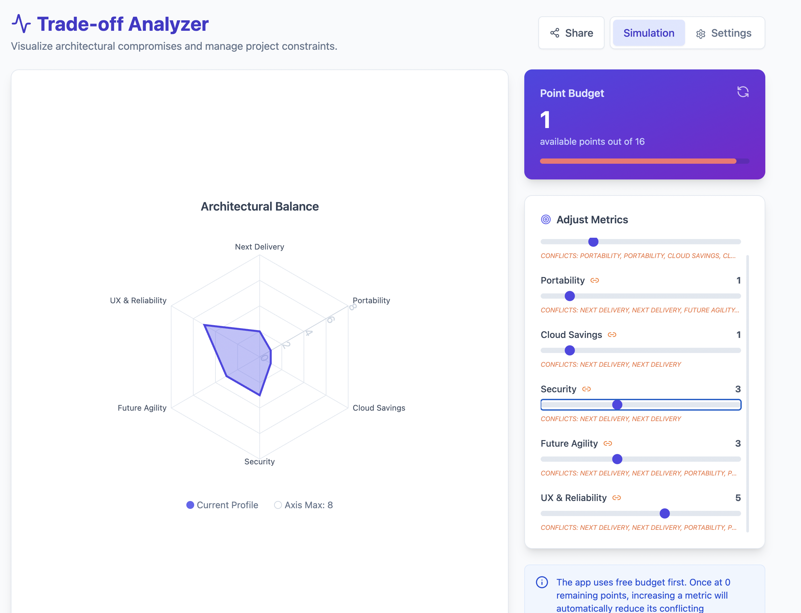

# Trade-Off Analyzer

Trade-Off Analyzer is a web application designed to help users visualize,
analyze, and balance multiple conflicting metrics or objectives. It provides
interactive dashboards, customizable sliders, and visualizations to support
decision-making in scenarios where trade-offs are necessary.

https://gunzip.github.io/trade-off-analyzer/



## Features

- Interactive dashboard for multi-criteria analysis
- Customizable metric sliders
- Visualizations for trade-off exploration (e.g., radar charts)
- Conflict mapping and warnings
- Settings and sharing options

## Use Cases

- Budget planning
- Resource allocation
- Multi-criteria decision analysis

## Getting Started

### Prerequisites

- Node.js (v18 or higher recommended)
- pnpm (preferred package manager)

### Installation

```sh
pnpm install
```

### Running the App

1. Navigate to the app directory:
   ```sh
   cd apps/trade-off-analyzer
   ```
2. Start the development server:
   ```sh
   pnpm dev
   ```
3. Open your browser and go to `http://localhost:5173` (or the port shown in the
   terminal).

### Building for Production

From the root or app directory:

```sh
pnpm build
```

## License

This project is licensed under the MIT License.

## Contributing

Contributions are welcome! Please open issues or submit pull requests for
improvements or bug fixes.

## Acknowledgments

- Built with React, TypeScript, Vite, and Tailwind CSS.
